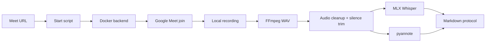

# Sprut MeetingBot Pipeline

Local, recording-first Google Meet automation for self-hosted meeting transcripts: browser join, local recording, FFmpeg cleanup, MLX Whisper transcription, pyannote diarization, and quality-gated Markdown output.

This project is for a local always-on machine, such as a Mac mini, where you control Docker, browser automation, FFmpeg, and local ML dependencies.

It is not a hosted SaaS product and it does not bypass Google Meet access controls.

## What it does

- Starts a local MeetingBot job from a Google Meet URL.
- Opens Google Meet in a Dockerized Playwright/Chromium backend.
- Records the meeting locally.
- Converts WebM to WAV with FFmpeg.
- Cleans audio and trims long terminal silence before ASR.
- Transcribes speech with local MLX Whisper.
- Runs speaker diarization with `pyannote.audio`.
- Extracts Google Meet participant names from People panel and visible tiles.
- Builds a Markdown protocol with explicit strict/best-effort quality notes.

## Who is this for?

Use this if you want:

- local-first meeting recording and transcription;
- control over where recordings/transcripts are stored;
- a hackable pipeline for Google Meet automation;
- Apple Silicon / Mac mini deployment;
- Whisper + pyannote based transcription/diarization without sending audio to a hosted transcription API.

Do not use it if:

- you need a polished hosted SaaS today;
- you cannot legally record the meeting;
- your Google Meet rooms block bot/guest access and you cannot invite/admit the bot;
- you expect perfect `voice -> person` mapping without active-speaker evidence.

## Operating flow



## Quick start

### 1. Install local prerequisites

On macOS / Apple Silicon:

```bash
brew install ffmpeg python@3.11 node git
brew install --cask docker google-chrome
```

Start Docker Desktop or Colima.

### 2. Create Python environment

```bash
python3.11 -m venv ~/.sprut-meetingbot/whisper-env
~/.sprut-meetingbot/whisper-env/bin/python -m pip install --upgrade pip wheel setuptools
~/.sprut-meetingbot/whisper-env/bin/python -m pip install -r requirements-whisper.txt
```

### 3. Configure secrets locally

```bash
cp config/meetingbot.env.example config/meetingbot.env
nano config/meetingbot.env
```

Set at least:

```bash
HF_TOKEN=hf_your_token_here
```

You must accept the Hugging Face terms for:

`pyannote/speaker-diarization-3.1`

Never commit `config/meetingbot.env`.

### 4. Check pyannote access

```bash
MEETINGBOT_CONFIG=config/meetingbot.env \
~/.sprut-meetingbot/whisper-env/bin/python scripts/meetingbot_pyannote_preflight.py
```

Expected:

```json
{"ok": true, "reason": "ok"}
```

### 5. Start backend

```bash
cd backend
docker compose up -d --build
curl -sS http://127.0.0.1:3001/health
curl -sS http://127.0.0.1:3001/isbusy
cd ..
```

Expected: healthy backend and `isbusy=0`.

### 6. Run a meeting recording

```bash
./scripts/meetingbot_recording_start.sh 'https://meet.google.com/xxx-yyyy-zzz' 2h
```

The dispatcher prints a `jobId` and creates artifacts under:

```text
runtime/jobs/<jobId>/
runtime/meetings/
```

## Google Meet access requirements

The bot is just another meeting participant.

You need one of these setups:

- the Meet link allows guests and a host admits `MeetingBot`;
- the meeting is configured so anyone with the link can join;
- a dedicated Google bot account is invited to the calendar/Meet;
- a dedicated bot browser profile is manually authorized outside the repository.

The bot cannot bypass restricted meetings, organization policies, or lobby admission.

If the bot is waiting in lobby, it is not recording yet.

## Quality model

`HTTP 202` and `/isbusy=1` do not prove recording. They mean the job was accepted.

A successful run needs:

- bot actually entered Meet;
- recording file appeared and grew;
- recording stabilized after the meeting;
- FFmpeg converted audio;
- Whisper produced text;
- pyannote produced speaker clusters;
- Markdown was generated with honest quality notes.

Strict success means speaker mapping is plausible and validated.

Best-effort means a useful transcript exists, but speaker-to-person mapping or diarization quality needs review.

See `docs/QUALITY_GATES.md`.

## Important limitation: names vs diarization

Google Meet participant names are not the same as diarization.

The pipeline can collect names such as `ALEKSEI ULIANOV` or `Алексей Ульянов` from tiles and the People panel. pyannote can split audio into voice clusters. But to prove that a cluster belongs to a specific name, you need active-speaker evidence by timestamp.

Recommended future upgrade:

- capture active speaker/tile highlight every 1–2 seconds;
- save `timestamp -> visible speaker name` evidence;
- join that evidence with pyannote and Whisper segments.

## Repository contents

- `backend/` — Dockerized TypeScript/Playwright meeting backend, derived from ScreenApp meeting-bot.
- `scripts/` — local dispatch, monitor, transcription, diarization, validation scripts.
- `config/meetingbot.env.example` — safe local config template.
- `docs/` — setup, architecture, quality gates, troubleshooting.
- `runtime/` — generated locally, ignored by git.

## Canonical source

This project is maintained by Aleksei Ulianov / Sprut_AI.
Canonical repository: https://github.com/AlekseiUL/sprut-meetingbot-pipeline

If you found this project mirrored, repackaged, or redistributed elsewhere, check this repository as the source of truth.

## Attribution

The browser meeting backend is derived from the MIT-licensed ScreenApp meeting-bot project: https://github.com/screenappai/meeting-bot

Where permitted by the applicable license, if you reuse, fork, modify, package, or publish this work, keep the original copyright and license notice and link back to the canonical repository.

## License

MIT. See `LICENSE` and `NOTICE.md`.
