# Architecture

```mermaid
flowchart LR
    A[Meet URL] --> B[recording_start.sh]
    B --> C[Backend health + isbusy]
    C --> D[POST /google/join]
    D --> E[Playwright Chromium joins Google Meet]
    E --> F[Browser MediaRecorder WebM]
    F --> G[Monitor waits for stable recording]
    G --> H[FFmpeg WebM to WAV]
    H --> I[Cleanup + terminal silence trim]
    I --> J[MLX Whisper transcription]
    I --> K[pyannote diarization]
    J --> L[Segment speaker assignment]
    K --> L
    L --> M[Strict/best-effort validation]
    M --> N[Markdown protocol]
    N --> O[Local file or optional notifier]
```

## Important state distinction

`HTTP 202` and `/isbusy=1` mean only that the backend accepted a job. They do not prove the bot has entered the meeting or that audio is being recorded.

A recording is considered proven only after downstream evidence exists:

- backend logs show Meet navigation and joined state;
- no lobby/admission block is present;
- a fresh recording file appears under `backend/dist/_tempvideo`;
- the file grows while the meeting is active;
- the monitor later sees the file stable and non-empty.

## Runtime artifacts

Generated artifacts are written under `runtime/` by default:

- `runtime/jobs/<jobId>/` — per-run logs, JSON, audio copies, diagnostics;
- `runtime/meetings/` — final Markdown files;
- `backend/dist/_tempvideo/` — backend recording output;
- `backend/debug-videos/` — optional participant/debug snapshots.

These folders are intentionally ignored by git.

## Current quality boundary

The pipeline can diarize audio clusters with pyannote and can capture Google Meet participant/tile names. However, exact `voice -> person name` mapping requires evidence. For production-grade naming, add active-speaker snapshots over time and join them to pyannote/Whisper segments.
